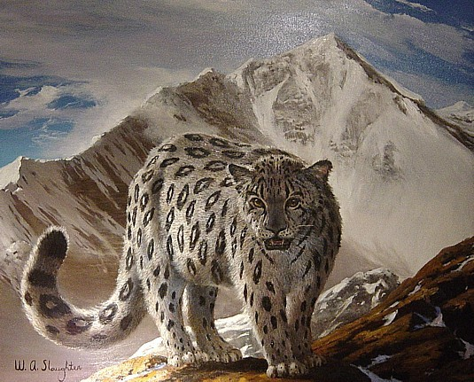
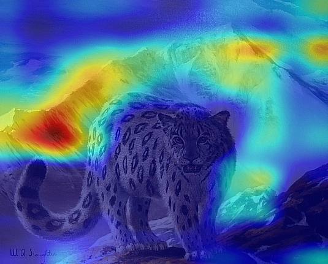
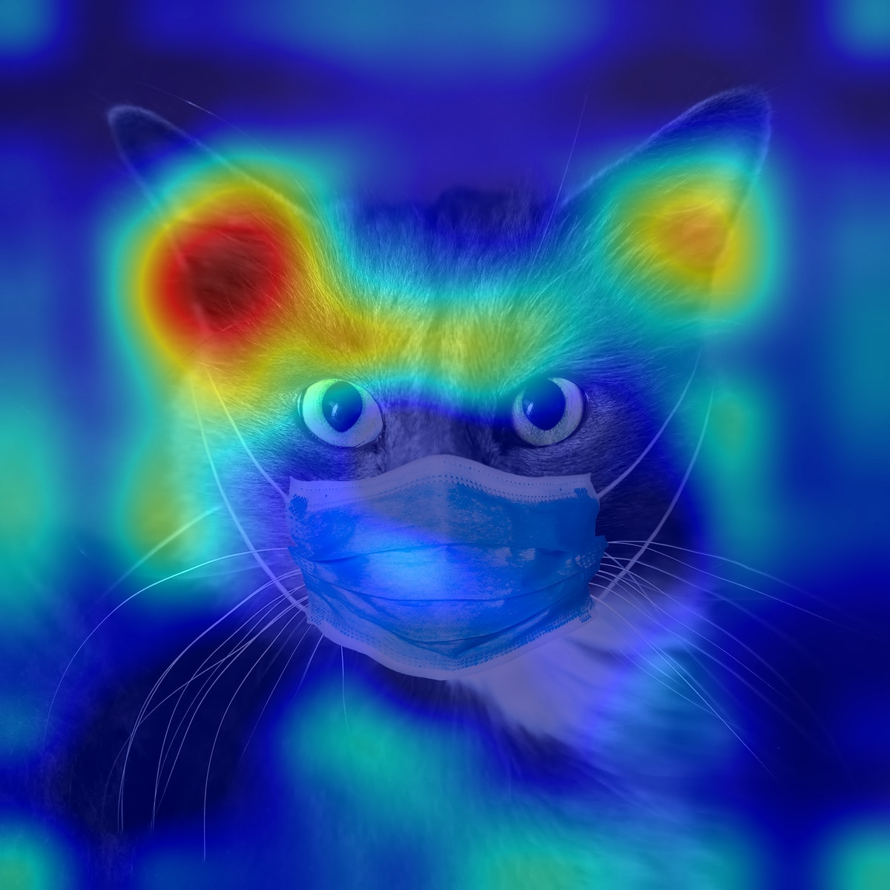
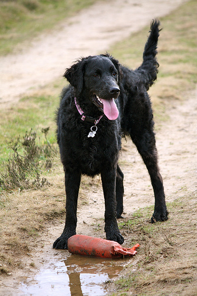
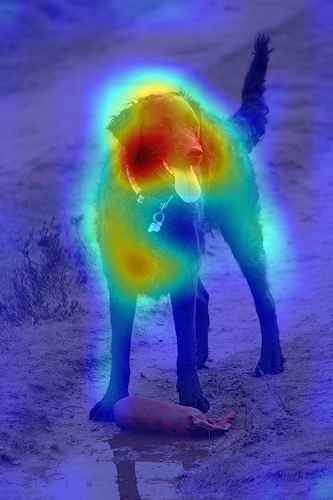
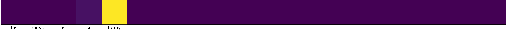

# GradCAM 
Reimplementation of https://arxiv.org/pdf/1610.02391.pdf in Tensorflow 2.1.

## Authors
* Max Holmberg
* Joel Lidin

## Run Grad-CAM for Images
```
python run.py --path image_path --output output_path
```
## Run Grad-CAM for binary sentiment classification
```
python run.py --text --output output_path --weights sentiment_cnn_weights --sentence "I love this movie"
```


## Results
#### Grad-CAM for Image classification
Original                   |  Heatmap overlay (predicted: Leopard)
:-------------------------:|:-------------------------:
   |  

Original                  |  Heatmap overlay (predicted: Egyptian cat)
:-------------------------:|:-------------------------:
   |  

Original                  |  Heatmap overlay (predicted: Curly coated retriever)
:-------------------------:|:-------------------------:
   |  

#### Grad-CAM for sentiment classification (predicted: positive)
